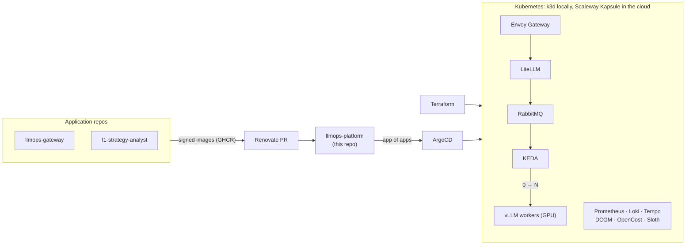
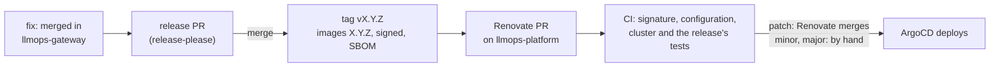

# llmops-platform

[](https://github.com/Mak5ens/llmops-platform/actions/workflows/ci.yml)
[](LICENSE)

**A production-grade Kubernetes platform for LLM workloads: built by Terraform, deployed from Git, observed end to end, and able to scale GPU inference to zero without blowing the budget.**

> Status: under construction. Milestone 2.1 (local cluster and GitOps) is done; next, 2.2 (observability, SLO and supply chain). See the [roadmap](#roadmap).

## Why

The [gateway](https://github.com/Mak5ens/llmops-gateway) runs, tenant teams are arriving, and hand-managed model servers no longer hold.
The Platform team builds a **production Kubernetes cluster**: created as code, deployed from Git, observed, secured, and running models on GPU with a measured cost per team.

This repo holds the **infrastructure and the GitOps configuration of every environment**. Application repos publish signed images; this repo describes what runs where. Renovate proposes version bumps as PRs and ArgoCD deploys after merge.

## How it works



Request path: team app → Envoy Gateway → LiteLLM (team key, anonymization, routing) → vLLM on the cluster → re-identified answer. Every step is traced (Langfuse, OpenTelemetry) and counted (tokens, GPU cost per namespace, so per team).

## Stack

| Function | Tool |
| -- | -- |
| Infrastructure as Code | Terraform (Scaleway Kapsule), k3d locally |
| GitOps | ArgoCD, app of apps, Helm or Kustomize |
| HTTP exposure | Gateway API with Envoy Gateway, cert-manager |
| Database and secrets | CloudNativePG, External Secrets Operator |
| Metrics, logs, traces | kube-prometheus-stack, Loki, Tempo, OpenTelemetry Collector |
| SLO | Sloth |
| Inference and autoscaling | vLLM, RabbitMQ, KEDA (scale 0 → N on queue length) |
| GPU and cost | NVIDIA GPU Operator, DCGM exporter, OpenCost |
| Load tests | k6 |
| Supply chain | GitHub Actions, Trivy, Syft (SBOM), cosign, Renovate |

## Quick start

Milestone 2.1 is under way: `just up` creates the local cluster and installs ArgoCD, which deploys the rest from Git. Today that is ArgoCD itself, HTTP exposure (Envoy Gateway, cert-manager), secrets (External Secrets), PostgreSQL (CloudNativePG), the gateway of block 1 with Presidio, Ollama and Langfuse, and observability (Prometheus, Grafana, Loki, Tempo, OpenTelemetry Collector).

Requirements: [Docker](https://docs.docker.com/engine/install/), [k3d](https://k3d.io/) v5.9.0, [kubectl](https://kubernetes.io/docs/tasks/tools/), [Helm](https://helm.sh/) v4 and [just](https://just.systems/).
The empty cluster takes about 1 GB of RAM, the platform as it stands about 13 to 14 GB, of which 3 GB for Presidio and LiteLLM, 2 GB for Langfuse and about 1.5 GB for observability; the target for the whole platform is a machine like a GitHub runner, 4 cores and 16 GB.

```bash
just up               # k3d cluster, then ArgoCD deploys every component from Git
just test             # cluster, Applications, self-heal, HTTPS, PostgreSQL failover and restore, latency → trace → logs, SLO alert
just ca-cert          # exports the local CA to local/ca.pem
just test-gateway     # the integration tests of block 1 against the cluster (needs ../llmops-gateway)
just argocd-password  # ArgoCD admin password; the UI is on https://argocd.localtest.me
just down             # deletes the cluster, its registry and its kube context
```

ArgoCD deploys what is on GitHub, not what is on your disk: it follows `main` by default. To try a branch, push it and run `REVISION=my-branch just up`.

### The local cluster

The cluster is described in [`local/k3d.yaml`](local/k3d.yaml):

- Kubernetes 1.37, the same minor version as Kapsule; Traefik disabled, since exposure goes through Envoy Gateway ([ADR-005](docs/adr/005-gateway-api-and-envoy-gateway.md));
- ports 80 and 443 of `localhost` go to the cluster's load balancer;
- a local registry for images built on the machine: push to `localhost:5050/<image>`, reference `registry.localhost:5050/<image>` in manifests. The platform itself pulls its images from GHCR;
- the `k3d-llmops` context is added to `~/.kube/config` without becoming the current one (unless there was none). Recipes always pass it explicitly.

`just cluster-up`, `just cluster-check` and `just cluster-down` handle the cluster alone.

### GitOps with ArgoCD

`just bootstrap` installs ArgoCD once and hands it the root Application. From then on, nothing is installed by hand:

- [`platform/<component>/`](platform/) holds each component as Kustomize, with a `base` and one overlay per environment, `local` and `cloud`;
- [`apps/`](apps/) is the app of apps, a small Helm chart: one ArgoCD Application per component of [`apps/values.yaml`](apps/values.yaml), pointing to `platform/<component>/overlays/<env>`. Sync waves order them, operators and CRDs first;
- the root Application renders this chart with the environment and the Git revision, including itself, so both are set once by the bootstrap;
- ArgoCD manages its own installation from [`platform/argocd/`](platform/argocd/), like any other component;
- every Application syncs automatically, prunes what was removed from Git, and repairs manual changes (self-heal).

ArgoCD compares with a server-side dry run (`controller.diff.server.side`), so the defaults the API server adds to Gateway API resources are not reported as drift.
Locally, ArgoCD polls GitHub every minute: a pushed change reaches the cluster within about a minute and a half.
The CI does the same on every PR: it creates the cluster, bootstraps ArgoCD from the branch under test and runs `just test`.

### HTTP exposure

Services are exposed through the Gateway API ([ADR-005](docs/adr/005-gateway-api-and-envoy-gateway.md)), never with an `Ingress`, which a pre-commit hook rejects:

- [`platform/envoy-gateway/`](platform/envoy-gateway/) installs Envoy Gateway and the Gateway API CRDs; [`platform/cert-manager/`](platform/cert-manager/) installs cert-manager;
- [`platform/gateway/`](platform/gateway/) holds the shared `Gateway` of the cluster, in the `gateway` namespace. Its HTTPS listener serves `*.localtest.me`, whose subdomains all resolve to 127.0.0.1; plain HTTP redirects to HTTPS;
- each service brings its own `HTTPRoute`. Only namespaces labelled `llmops-platform/gateway-access: "true"` can attach one, so a tenant cannot take over another host name;
- locally, certificates come from a certificate authority created by cert-manager in the cluster. `just ca-cert` exports it, to pass to curl (`--cacert local/ca.pem`) or to import in a browser. The CA is new with every cluster.

### Databases and secrets

- [`platform/cloudnative-pg/`](platform/cloudnative-pg/) installs the CloudNativePG operator and its Barman Cloud plugin ([ADR-018](docs/adr/018-postgresql-cloudnativepg.md)). Each application that needs PostgreSQL declares its own `Cluster` in its component: `litellm-db` in [`platform/llm-gateway/`](platform/llm-gateway/), `langfuse-db` in [`platform/langfuse/`](platform/langfuse/);
- each cluster runs a primary and a synchronous replica on different nodes. If the primary fails, the replica takes over without losing a commit: 15 s measured locally;
- WAL is archived continuously to S3, with a base backup every night and one at creation, kept 7 days: any point in time of the last week can be restored ([runbook](docs/runbooks/postgres-restore.md)). Locally, the S3 store is SeaweedFS ([`platform/object-storage/`](platform/object-storage/)); on Kapsule, Scaleway Object Storage;
- [`platform/external-secrets/`](platform/external-secrets/) installs External Secrets Operator ([ADR-019](docs/adr/019-external-secrets.md)). Every `ExternalSecret` reads the `ClusterSecretStore` named `platform` ([`platform/secret-store/`](platform/secret-store/)): locally, random values that `just bootstrap` writes once into the `local-secrets` namespace; on Kapsule, Scaleway Secret Manager. No secret value is ever in Git, and gitleaks checks the whole history in the CI;
- applications connect to their database with the `<cluster>-app` Secret that CloudNativePG creates.

`just test` deletes the primary of `litellm-db` and checks that the last commit survives, then restores a fresh backup into a new cluster from S3 alone.

### The gateway of block 1

The gateway of [`llmops-gateway`](https://github.com/Mak5ens/llmops-gateway) runs on the cluster with the same behavior as in its Docker Compose stack, which stays the quickest demo without Kubernetes:

- [`platform/llm-gateway/`](platform/llm-gateway/): LiteLLM from its official Helm chart, on `https://llm.localtest.me`; Presidio Analyzer and Anonymizer; two Ollama servers until vLLM (milestone 3); and the `tenants-bootstrap` Job, which ArgoCD runs after every sync to create the client teams, their keys and their Langfuse projects;
- [`platform/langfuse/`](platform/langfuse/): Langfuse from its official chart, on `https://langfuse.localtest.me`, with its database on CloudNativePG, its events and media on SeaweedFS, and a single-node ClickHouse (the chart's needs the ClickHouse operator);
- the images of our own come from llmops-gateway on GHCR: the French Presidio Analyzer, and LiteLLM with the guardrail class and the bootstrap scripts. `config/litellm.yaml` and `config/tenants.yaml` are copies of llmops-gateway's: the services have the same names as in Compose, so the files are identical. A release of the gateway reaches the cluster through a Renovate PR (see below);
- every secret (master key, team keys, Langfuse keys and accounts) is written once to `local-secrets` by `just bootstrap`; `just gateway-secrets` prints the ones you need to call the gateway or sign in to Langfuse.

The integration tests of block 1 run unchanged against the cluster, in the CI after `just test` and locally with `just test-gateway`: 46 tests, about 10 minutes, most of it waiting for ArgoCD to put things back after the fallback and leak tests.

Two things the move taught:

- Envoy cuts a request after 15 s by default. A `chat-large` call that falls back to `chat-small` takes up to 20 s, so the route to LiteLLM has a 90 s timeout.
- Kustomize's namespace transformer leaves the resources rendered from a Helm chart alone. Without a namespace, the LiteLLM Deployment kept the name of its ConfigMap without the content hash, and would not restart on a configuration change. A patch sets the namespace.

### From a commit of the gateway to the cluster

A new version of the gateway reaches the cluster through a PR, without copying a tag by hand ([ADR-023](docs/adr/023-image-propagation.md)):



1. release-please keeps a release PR open in llmops-gateway, with the next version and the changelog, from the merged Conventional Commits.
2. Merging it tags `vX.Y.Z` and publishes both images as `X.Y.Z`, signed by `build-image.yml` with their SBOM (ADR-022).
3. At its next run, within the hour, Renovate opens one PR here for both images.
4. The `gateway-release` job checks the images' signatures and SBOMs (`just verify-images`) and that `platform/llm-gateway/base/config/` matches the release. When a release changes `config/litellm.yaml` or `config/tenants.yaml`, the job fails with the diff: `just gateway-config` on the PR's branch copies the release's files, in one commit.
5. The `cluster` job deploys the PR's branch and runs the gateway's integration tests from the release's tag.
6. Renovate merges a patch once every check has passed. A minor is merged by hand, and a major also waits for an approval on the dependency dashboard.
7. ArgoCD deploys `main`: the *llm-gateway* Application shows the new image tag.

### Observability

Metrics, logs and traces lead to one another ([ADR-020](docs/adr/020-observability-stack.md)). Grafana is on `https://grafana.localtest.me` (`just grafana-password`):

- [`platform/monitoring/`](platform/monitoring/): kube-prometheus-stack (Prometheus, Alertmanager, Grafana, node-exporter, kube-state-metrics), the `Gateway` dashboard and the alert rules, in Git. Every `ServiceMonitor`, `PodMonitor` and `PrometheusRule` of the cluster is picked up;
- [`platform/loki/`](platform/loki/) and [`platform/tempo/`](platform/tempo/): one process each, 48 h of logs and 24 h of traces. Tempo's metrics generator turns spans into rate and latency metrics, with the trace ID of sampled requests (exemplars);
- [`platform/otel-collector/`](platform/otel-collector/): one OpenTelemetry Collector per node, the single entry point of telemetry. It reads the pod logs of its node, receives OTLP from applications, adds the Kubernetes attributes, and sends logs to Loki, traces to Tempo and metrics to Prometheus;
- Envoy traces every request through the Gateway and sends its access logs over OTLP, with the trace ID.

On the `Gateway` dashboard, a dot on the latency graph is an exemplar: a click opens the request's trace in Tempo, and *Logs for this span* opens its access log in Loki. `scripts/observability-check.sh` follows these two clicks through the APIs on every run of `just test`.
The control plane is not scraped: it is embedded in k3s and managed on Kapsule. The rules that would fire for its missing targets are off.

### SLOs and runbooks

The gateway has two SLOs, measured by Envoy on the route to LiteLLM ([ADR-021](docs/adr/021-gateway-slos.md), [`slo/gateway.yaml`](slo/gateway.yaml)):

| SLO | Objective, 30 days | Alert |
| -- | -- | -- |
| Availability | 99.5 % of requests without a 5xx (4xx are the gateway doing its job) | `GatewayAvailabilityBudgetBurn` → [runbook](docs/runbooks/gateway-5xx.md) |
| Latency | 95 % of requests answered in under 30 s (total duration; time to first token with vLLM, milestone 3) | `GatewayLatencyBudgetBurn` → [runbook](docs/runbooks/gateway-latency.md) |

Sloth's CLI generates the recording rules and the multi-window burn rate alerts: `just slo` after a change to `slo/`, checked by a pre-commit hook. A page fires when the budget burns 14.4 times too fast over 5 minutes and 1 hour. `scripts/slo-check.sh` stops the server of `chat-small` and checks that it fires, with its runbook: 169 s locally.
A model server that restarts in a loop has its own alert, `ModelServerCrashLooping` → [runbook](docs/runbooks/model-server-crashloop.md).

Grafana holds the error budget (*SLO / Detail*, *High level Sloth SLOs*) next to the `Gateway` dashboard, and the community dashboards of CloudNativePG and Envoy Gateway at a pinned revision (`scripts/fetch-dashboards.py`).

### On minikube or a k3s server

k3d only creates the cluster ([ADR-017](docs/adr/017-local-cluster-k3d.md)): the bootstrap runs on any cluster, given its kube context.

- **minikube** (checked on 2026-10-07 with minikube v1.39.0, a single node): `minikube start --kubernetes-version=v1.37.1 --cpus=8 --memory=16g`, then `minikube tunnel` in another terminal so that LoadBalancer Services get an address; without it, the Gateway stays `AddressNotAssigned` and never becomes healthy. `minikube start` makes `minikube` the current kube context.
- **k3s server**: before installing, disable Traefik in `/etc/rancher/k3s/config.yaml` (`disable: [traefik]`) and skip the Gateway API CRDs that k3s bundles, which conflict with Envoy Gateway's: `touch /var/lib/rancher/k3s/server/manifests/gateway-api-crd.yaml.skip`. Then copy `/etc/rancher/k3s/k3s.yaml` into your kubeconfig.

On both, `*.localtest.me` resolves to 127.0.0.1: point the host names to the address of the Envoy Service instead, in `/etc/hosts` or with `curl --resolve`.
On minikube, the tunnel asks for sudo to bind ports 80 and 443 on 127.0.0.1. Without it, use the NodePort of Envoy's HTTPS listener on the node's address:

```bash
port=$(kubectl --context minikube -n envoy-gateway-system get svc \
  -o jsonpath='{.items[?(@.spec.type=="LoadBalancer")].spec.ports[?(@.port==443)].nodePort}')
curl --cacert local/ca.pem --resolve "llm.localtest.me:$port:$(minikube ip)" "https://llm.localtest.me:$port/health/liveliness"
```

There, every Application is synced and healthy, the PostgreSQL failover takes 20 s as on k3d, and ArgoCD, LiteLLM and Langfuse answer over HTTPS with the local CA's certificate.

Then bootstrap it: `just bootstrap <kube context>` (for example `just bootstrap minikube`).

To contribute, install the git hooks (requires [pre-commit](https://pre-commit.com/)):

```bash
just hooks
just lint
```

## Roadmap

### Milestone 2: Kubernetes in GitOps

- [x] **2.1 Local cluster and GitOps**: k3d, ArgoCD app of apps, Envoy Gateway, cert-manager, CloudNativePG, External Secrets. The block 1 gateway deployed from Git.
- [ ] **2.2 Observability, SLO and supply chain**: Prometheus, Loki, Tempo, OpenTelemetry. Two Sloth SLOs with alerts and runbooks. Trivy, Syft, cosign in CI; Renovate.
- [ ] **2.3 Cloud cluster with Terraform**: the same platform on Scaleway Kapsule, estimated monthly cost. Article 2.

### Milestone 3: autoscaling and GPU observability

- [ ] **3.1 Workers and KEDA autoscaling**: RabbitMQ, simulated workers then vLLM, KEDA from 0 to N. k6 load profiles, measured scale-up times including cold start.
- [ ] **3.2 GPU observability and unit cost**: DCGM exporter, vLLM metrics (TTFT, tokens/s, KV cache), OpenCost. One dashboard with queue, replicas, GPU, TTFT and cumulative cost on the same time axis.
- [ ] **3.3 F1 season benchmark**: analyse every session of a Formula 1 season as jobs, cost per session compared with a commercial API. Article 3.

GPUs are rented on Scaleway for a few hours for the final measurements, then `terraform destroy`.

## Architecture decisions

This repo hosts the **cross-cutting ADRs** for the whole platform in [`docs/adr/`](docs/adr/): GitHub Actions, Scaleway, Terraform, RabbitMQ, Envoy Gateway, self-hosted Langfuse, the multi-repo layout, k3d for the local cluster, CloudNativePG, External Secrets, the observability stack and the gateway's SLOs. Repo-specific ADRs stay in their own repo.

## Part of an internal AI platform

| Repo | Role |
| -- | -- |
| [llmops-gateway](https://github.com/Mak5ens/llmops-gateway) | Block 1: single entry point to LLMs, keys, budgets, anonymization, tracing |
| **llmops-platform** (this repo) | Block 2: Kubernetes in GitOps, vLLM autoscaling, GPU observability, costs |
| [f1-strategy-analyst](https://github.com/Mak5ens/f1-strategy-analyst) | Block 3: first tenant, an agent with RAG and an evaluation CI |

Write-ups coming on [maxence-labbe.fr](https://maxence-labbe.fr): article 2, *Une plateforme Kubernetes de A à Z en GitOps*, and article 3, *Scaler des LLM à zéro : chiffres et coûts réels*.

## License

[MIT](LICENSE).
