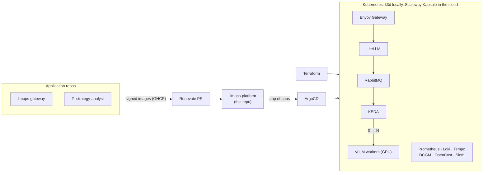

# llmops-platform

[](https://github.com/Mak5ens/llmops-platform/actions/workflows/ci.yml)
[](LICENSE)

**A production-grade Kubernetes platform for LLM workloads: built by Terraform, deployed from Git, observed end to end, and able to scale GPU inference to zero without blowing the budget.**

> Status: under construction, milestone 2.1 (local cluster and GitOps) in progress. See the [roadmap](#roadmap).

## Why

The [gateway](https://github.com/Mak5ens/llmops-gateway) runs, tenant teams are arriving, and hand-managed model servers no longer hold.
The Platform team builds a **production Kubernetes cluster**: created as code, deployed from Git, observed, secured, and running models on GPU with a measured cost per team.

This repo holds the **infrastructure and the GitOps configuration of every environment**. Application repos publish signed images; this repo describes what runs where. Renovate proposes version bumps as PRs and ArgoCD deploys after merge.

## How it works



Request path: team app → Envoy Gateway → LiteLLM (team key, anonymization, routing) → vLLM on the cluster → re-identified answer. Every step is traced (Langfuse, OpenTelemetry) and counted (tokens, GPU cost per namespace, so per team).

## Stack

| Function | Tool |
| -- | -- |
| Infrastructure as Code | Terraform (Scaleway Kapsule), k3d locally |
| GitOps | ArgoCD, app of apps, Helm or Kustomize |
| HTTP exposure | Gateway API with Envoy Gateway, cert-manager |
| Database and secrets | CloudNativePG, External Secrets Operator |
| Metrics, logs, traces | kube-prometheus-stack, Loki, Tempo, OpenTelemetry Collector |
| SLO | Sloth |
| Inference and autoscaling | vLLM, RabbitMQ, KEDA (scale 0 → N on queue length) |
| GPU and cost | NVIDIA GPU Operator, DCGM exporter, OpenCost |
| Load tests | k6 |
| Supply chain | GitHub Actions, Trivy, Syft (SBOM), cosign, Renovate |

## Quick start

Milestone 2.1 is under way: `just up` creates the local cluster and installs ArgoCD, which manages itself from Git. The other components come next (LAB-125 onwards).

Requirements: [Docker](https://docs.docker.com/engine/install/), [k3d](https://k3d.io/) v5.9.0, [kubectl](https://kubernetes.io/docs/tasks/tools/), [Helm](https://helm.sh/) v4 and [just](https://just.systems/).
The empty cluster takes about 1 GB of RAM; the target for the whole platform is a machine like a GitHub runner, 4 cores and 16 GB.

```bash
just up          # k3d cluster, then ArgoCD and the root Application (about 1 min 15 s)
just test        # cluster healthy, every Application synced and healthy, self-heal
just argocd-ui   # admin password, then the UI on http://localhost:8080
just down        # deletes the cluster, its registry and its kube context
```

ArgoCD deploys what is on GitHub, not what is on your disk: it follows `main` by default. To try a branch, push it and run `REVISION=my-branch just up`.

### The local cluster

The cluster is described in [`local/k3d.yaml`](local/k3d.yaml):

- Kubernetes 1.37, the same minor version as Kapsule; Traefik disabled, since exposure goes through Envoy Gateway ([ADR-005](docs/adr/005-gateway-api-and-envoy-gateway.md));
- ports 80 and 443 of `localhost` go to the cluster's load balancer;
- a local registry for images built on the machine: push to `localhost:5050/<image>`, reference `registry.localhost:5050/<image>` in manifests. The platform itself pulls its images from GHCR;
- the `k3d-llmops` context is added to `~/.kube/config` without becoming the current one (unless there was none). Recipes always pass it explicitly.

`just cluster-up`, `just cluster-check` and `just cluster-down` handle the cluster alone.

### GitOps with ArgoCD

`just bootstrap` installs ArgoCD once and hands it the root Application. From then on, nothing is installed by hand:

- [`platform/<component>/`](platform/) holds each component as Kustomize, with a `base` and one overlay per environment, `local` and `cloud`;
- [`apps/`](apps/) is the app of apps, a small Helm chart: one ArgoCD Application per component of [`apps/values.yaml`](apps/values.yaml), pointing to `platform/<component>/overlays/<env>`. Sync waves order them, operators and CRDs first;
- the root Application renders this chart with the environment and the Git revision, including itself, so both are set once by the bootstrap;
- ArgoCD manages its own installation from [`platform/argocd/`](platform/argocd/), like any other component;
- every Application syncs automatically, prunes what was removed from Git, and repairs manual changes (self-heal).

Locally, ArgoCD polls GitHub every minute: a pushed change reaches the cluster within about a minute and a half.
The CI does the same on every PR: it creates the cluster, bootstraps ArgoCD from the branch under test and runs `just test`.

### On minikube or a k3s server

k3d only creates the cluster ([ADR-017](docs/adr/017-local-cluster-k3d.md)): the bootstrap runs on any cluster, given its kube context.

- **minikube**: `minikube start --kubernetes-version=v1.37.0 --cpus=4 --memory=16g`, then `minikube tunnel` in another terminal so that LoadBalancer Services get an address.
- **k3s server**: disable Traefik in `/etc/rancher/k3s/config.yaml` (`disable: [traefik]`) before installing, and copy `/etc/rancher/k3s/k3s.yaml` into your kubeconfig.

Then bootstrap it: `just bootstrap <kube context>` (for example `just bootstrap minikube`).

To contribute, install the git hooks (requires [pre-commit](https://pre-commit.com/)):

```bash
just hooks
just lint
```

## Roadmap

### Milestone 2: Kubernetes in GitOps

- [ ] **2.1 Local cluster and GitOps**: k3d, ArgoCD app of apps, Envoy Gateway, cert-manager, CloudNativePG, External Secrets. The block 1 gateway deployed from Git.
- [ ] **2.2 Observability, SLO and supply chain**: Prometheus, Loki, Tempo, OpenTelemetry. Two Sloth SLOs with alerts and runbooks. Trivy, Syft, cosign in CI; Renovate.
- [ ] **2.3 Cloud cluster with Terraform**: the same platform on Scaleway Kapsule, estimated monthly cost. Article 2.

### Milestone 3: autoscaling and GPU observability

- [ ] **3.1 Workers and KEDA autoscaling**: RabbitMQ, simulated workers then vLLM, KEDA from 0 to N. k6 load profiles, measured scale-up times including cold start.
- [ ] **3.2 GPU observability and unit cost**: DCGM exporter, vLLM metrics (TTFT, tokens/s, KV cache), OpenCost. One dashboard with queue, replicas, GPU, TTFT and cumulative cost on the same time axis.
- [ ] **3.3 F1 season benchmark**: analyse every session of a Formula 1 season as jobs, cost per session compared with a commercial API. Article 3.

GPUs are rented on Scaleway for a few hours for the final measurements, then `terraform destroy`.

## Architecture decisions

This repo hosts the **cross-cutting ADRs** for the whole platform in [`docs/adr/`](docs/adr/): GitHub Actions, Scaleway, Terraform, RabbitMQ, Envoy Gateway, self-hosted Langfuse, the multi-repo layout and k3d for the local cluster. Repo-specific ADRs stay in their own repo.

## Part of an internal AI platform

| Repo | Role |
| -- | -- |
| [llmops-gateway](https://github.com/Mak5ens/llmops-gateway) | Block 1: single entry point to LLMs, keys, budgets, anonymization, tracing |
| **llmops-platform** (this repo) | Block 2: Kubernetes in GitOps, vLLM autoscaling, GPU observability, costs |
| [f1-strategy-analyst](https://github.com/Mak5ens/f1-strategy-analyst) | Block 3: first tenant, an agent with RAG and an evaluation CI |

Write-ups coming on [maxence-labbe.fr](https://maxence-labbe.fr): article 2, *Une plateforme Kubernetes de A à Z en GitOps*, and article 3, *Scaler des LLM à zéro : chiffres et coûts réels*.

## License

[MIT](LICENSE).
