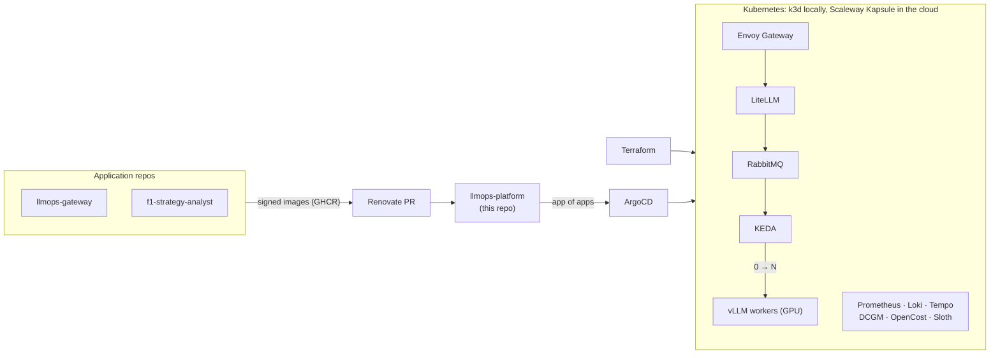

# llmops-platform

[](https://github.com/Mak5ens/llmops-platform/actions/workflows/ci.yml)
[](LICENSE)

**A production-grade Kubernetes platform for LLM workloads: built by Terraform, deployed from Git, observed end to end, and able to scale GPU inference to zero without blowing the budget.**

> Status: under construction. Work starts with milestone 2.1 (local cluster and GitOps). See the [roadmap](#roadmap).

## Why

The [gateway](https://github.com/Mak5ens/llmops-gateway) runs, tenant teams are arriving, and hand-managed model servers no longer hold.
The Platform team builds a **production Kubernetes cluster**: created as code, deployed from Git, observed, secured, and running models on GPU with a measured cost per team.

This repo holds the **infrastructure and the GitOps configuration of every environment**. Application repos publish signed images; this repo describes what runs where. Renovate proposes version bumps as PRs and ArgoCD deploys after merge.

## How it works



Request path: team app → Envoy Gateway → LiteLLM (team key, anonymization, routing) → vLLM on the cluster → re-identified answer. Every step is traced (Langfuse, OpenTelemetry) and counted (tokens, GPU cost per namespace, so per team).

## Stack

| Function | Tool |
| -- | -- |
| Infrastructure as Code | Terraform (Scaleway Kapsule), k3d locally |
| GitOps | ArgoCD, app of apps, Helm or Kustomize |
| HTTP exposure | Gateway API with Envoy Gateway, cert-manager |
| Database and secrets | CloudNativePG, External Secrets Operator |
| Metrics, logs, traces | kube-prometheus-stack, Loki, Tempo, OpenTelemetry Collector |
| SLO | Sloth |
| Inference and autoscaling | vLLM, RabbitMQ, KEDA (scale 0 → N on queue length) |
| GPU and cost | NVIDIA GPU Operator, DCGM exporter, OpenCost |
| Load tests | k6 |
| Supply chain | GitHub Actions, Trivy, Syft (SBOM), cosign, Renovate |

## Quick start

Not runnable yet. The target is one command that creates the local k3d cluster and deploys everything through ArgoCD:

```bash
make up     # k3d cluster + ArgoCD + every app
make test
make down
```

To contribute today, install the git hooks (requires [pre-commit](https://pre-commit.com/)):

```bash
make hooks
make lint
```

## Roadmap

### Milestone 2: Kubernetes in GitOps

- [ ] **2.1 Local cluster and GitOps**: k3d, ArgoCD app of apps, Envoy Gateway, cert-manager, CloudNativePG, External Secrets. The block 1 gateway deployed from Git.
- [ ] **2.2 Observability, SLO and supply chain**: Prometheus, Loki, Tempo, OpenTelemetry. Two Sloth SLOs with alerts and runbooks. Trivy, Syft, cosign in CI; Renovate.
- [ ] **2.3 Cloud cluster with Terraform**: the same platform on Scaleway Kapsule, estimated monthly cost. Article 2.

### Milestone 3: autoscaling and GPU observability

- [ ] **3.1 Workers and KEDA autoscaling**: RabbitMQ, simulated workers then vLLM, KEDA from 0 to N. k6 load profiles, measured scale-up times including cold start.
- [ ] **3.2 GPU observability and unit cost**: DCGM exporter, vLLM metrics (TTFT, tokens/s, KV cache), OpenCost. One dashboard with queue, replicas, GPU, TTFT and cumulative cost on the same time axis.
- [ ] **3.3 F1 season benchmark**: analyse every session of a Formula 1 season as jobs, cost per session compared with a commercial API. Article 3.

GPUs are rented on Scaleway for a few hours for the final measurements, then `terraform destroy`.

## Architecture decisions

This repo hosts the **cross-cutting ADRs** for the whole platform in [`docs/adr/`](docs/adr/): GitHub Actions, Scaleway, Terraform, RabbitMQ, Envoy Gateway, self-hosted Langfuse and the multi-repo layout. Repo-specific ADRs stay in their own repo.

## Part of an internal AI platform

| Repo | Role |
| -- | -- |
| [llmops-gateway](https://github.com/Mak5ens/llmops-gateway) | Block 1: single entry point to LLMs, keys, budgets, anonymization, tracing |
| **llmops-platform** (this repo) | Block 2: Kubernetes in GitOps, vLLM autoscaling, GPU observability, costs |
| [f1-strategy-analyst](https://github.com/Mak5ens/f1-strategy-analyst) | Block 3: first tenant, an agent with RAG and an evaluation CI |

Write-ups coming on [maxence-labbe.fr](https://maxence-labbe.fr): article 2, *Une plateforme Kubernetes de A à Z en GitOps*, and article 3, *Scaler des LLM à zéro : chiffres et coûts réels*.

## License

[MIT](LICENSE).
